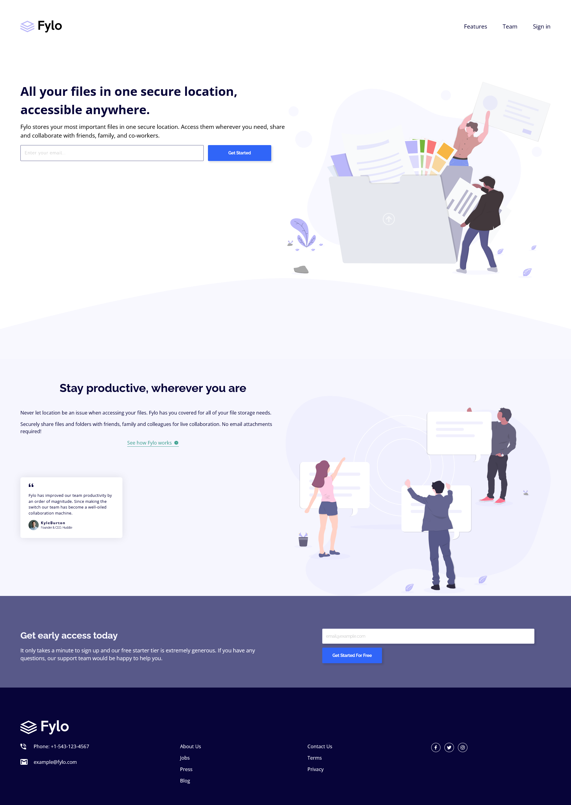

# Frontend Mentor - Fylo landing page with two column layout solution

This is a solution to the [Fylo landing page with two column layout challenge on Frontend Mentor](https://www.frontendmentor.io/challenges/fylo-landing-page-with-two-column-layout-5ca5ef041e82137ec91a50f5). Frontend Mentor challenges help you improve your coding skills by building realistic projects. 

## Table of contents

- [Overview](#overview)
  - [The challenge](#the-challenge)
  - [Screenshot](#screenshot)
  - [Links](#links)
- [My process](#my-process)
  - [Built with](#built-with)
  - [What I learned](#what-i-learned)
  - [Useful resources](#useful-resources)
- [Author](#author)

## Overview

### The challenge

Users should be able to:

- View the optimal layout for the site depending on their device's screen size
- See hover states for all interactive elements on the page

### Screenshot




### Links

- Solution URL: [Github](https://github.com/MikeBeloborodov/fylo_landing_page)
- Live Site URL: [Add live site URL here](https://your-live-site-url.com)

## My process

### Built with

- Semantic HTML5 markup
- CSS custom properties
- Flexbox
- CSS Grid
- Mobile-first workflow

### What I learned

First of all this was my first big full landing page with responsive design. A lot of work, it wasn't easy, but I've learned a lot!

One of the problems I had here is selector priority conflicts, for example I had a lot of generalisations in the beginning, like this:

```CSS
header img {
    max-height: 3rem;
    width: auto;
}

nav ul {
    display: flex;
    flex-direction: row;
    list-style-type: none;
    flex-wrap: wrap;
    gap: 3.8rem;
}


header a {
    display: block;
    text-decoration: none;
    color: var(--clr-very-dark-blue);
    font-size: 1.4rem;
}
```

But very soon I understood that they vere pretty specific and do not repeat after, so I had to override a lot of code later. I'm not going to refactor it, too much time, just something to look out for in my next project.

I generaly had a lot of problems with class naming, gotta structure that somehow from now on.

### Useful resources

- [Pixel to Ems conversion](https://www.w3schools.com/tags/ref_pxtoemconversion.asp) - This helped me with pixel to em conversion, very convenient.

## Author

- Github - [Mike Beloborodov](https://github.com/MikeBeloborodov)
- Frontend Mentor - [@MikeBeloborodov](https://www.frontendmentor.io/profile/MikeBeloborodov)